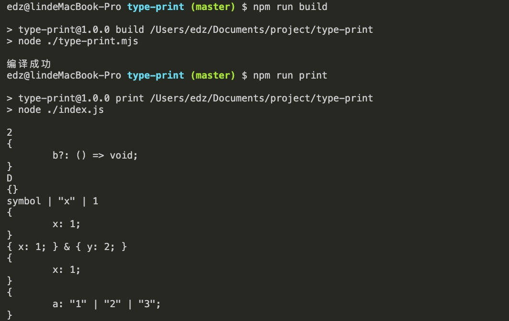

# ts-type-print

这是 TS 打印类型的 demo，不可用于生产环境

## Usage

拉取或 fork 仓库

修改 `test.ts`，使其能够打印类型

example：

test.ts
```ts
type A = 1
console.log(A)
```

然后执行 `npm run build` 进行编译

执行 `npm run print`

## Result

